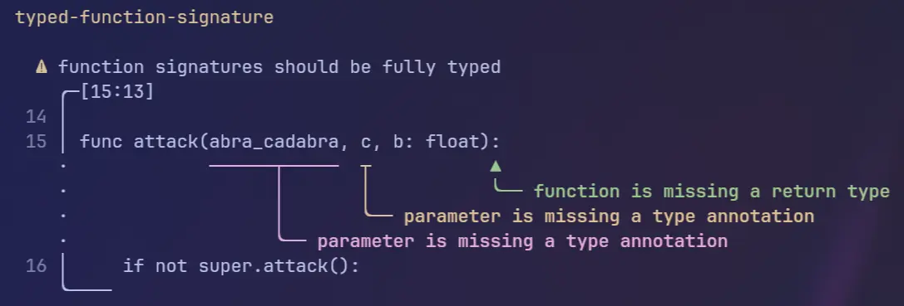

# gdscript-foli

This is a [GDScript](https://docs.godotengine.org/en/stable/tutorials/scripting/gdscript/index.html) ~~formatter~~ (soon️™) and linter.

## Useful Links

- <https://xaedes.github.io/online-sexpr-format/>
- <https://tree-sitter.github.io/tree-sitter/using-parsers/queries/index.html>

## Dependencies

- [`miette`](https://docs.rs/miette/latest/miette/): Annotated diagnostics
- [`tree-sitter`](https://lib.rs/crates/tree-sitter): Source code AST parser
  - [`tree-sitter-gdscript`](https://docs.rs/tree-sitter-gdscript/latest/tree_sitter_gdscript/)
  - [`tree-sitter-godot-resource`](https://docs.rs/tree-sitter-godot-resource/latest/tree_sitter_godot_resource/)

## Example Lint

## Yoinked From

- <https://godotengine.org/asset-library/asset/2520>
- <https://github.com/Scony/godot-gdscript-toolkit>
- <https://github.com/hedin-hiervard/gdlint>
